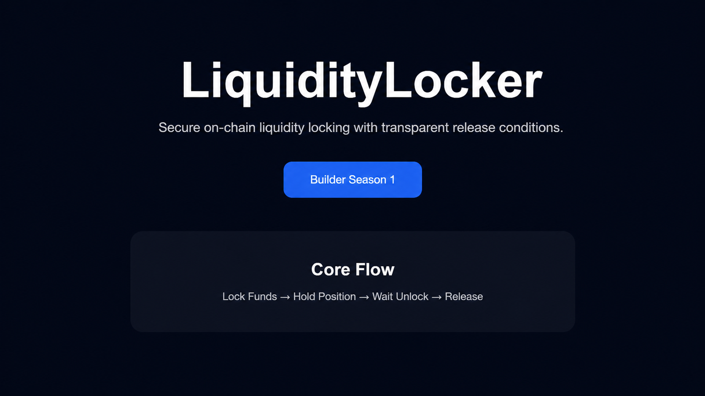

# LiquidityLocker

Secure on-chain liquidity locking with transparent release conditions.

<p align="center">

</p>

## Deployment

- Network: IOPN Testnet
- Contract Address: `0xd450F0Bf17696F54C3132D9333bE22895e07B564`
- Explorer: [View Contract](https://testnet.iopn.tech/address/0xd450F0Bf17696F54C3132D9333bE22895e07B564)
- Live Demo: https://opn-liquiditylocker.vercel.app

A lightweight liquidity locking protocol built on OPN Chain for Builders Season 1.

---

## Overview

LiquidityLocker enables users to lock liquidity on-chain and release it only after a predefined unlock time.

The protocol focuses on transparency, simplicity, and verifiable lock conditions.

---

## Features

* Time-based liquidity locking
* User-controlled release
* Extend lock duration
* Public lock visibility
* Lightweight architecture

---

## Smart Contract

Contract:

`contracts/LiquidityLocker.sol`

### Purpose

LiquidityLocker enables users to securely lock native assets on-chain and release them only after predefined unlock conditions are met.

The protocol is designed to demonstrate transparent capital locking and deterministic fund release.

### Core Functions

#### `lock(uint256 unlockTime)`

Creates a new liquidity position by locking funds until a future timestamp.

#### `extendLock(uint256 newUnlockTime)`

Extends the active lock period without requiring users to withdraw and relock assets.

#### `release()`

Unlocks and transfers funds back to the position owner once the lock period expires.

#### `getLock(address user)`

Returns current position data including amount, unlock timestamp, and release status.

---

## Architecture

```text
User
  ↓
Deposit Liquidity
  ↓
Create Lock Position
  ↓
Store Unlock Conditions
  ↓
Wait Until Expiration
  ↓
Release Locked Funds
```
---

## Security Considerations

* Time-based release validation
* User-owned withdrawal flow
* Prevent early release attempts
* Minimal state transitions

---

## Deployment

Tech Stack:

* Solidity ^0.8.20
* Remix IDE
* GitHub
* Vercel

---

## Roadmap

### Phase 1

* Contract deployment
* Basic UI
* Testing

### Phase 2

* Dashboard
* Position history

---

## Status

Season 1 Builder Submission

Experimental Prototype

MIT License

---

## Tech Stack

* Solidity
* HTML
* CSS
* JavaScript
* OPN Chain
* Vercel
